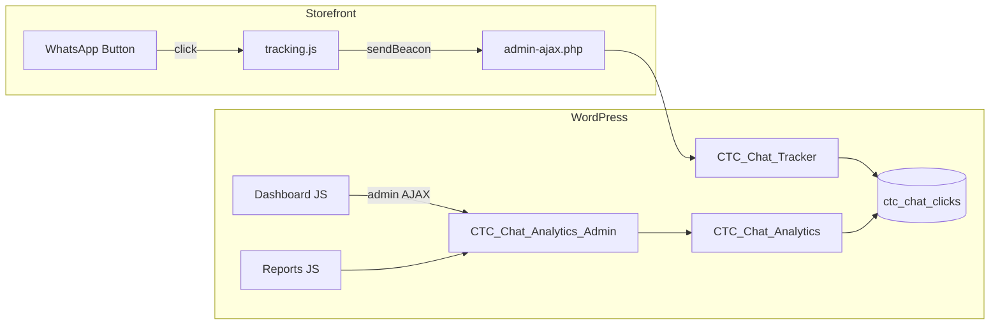

# Implementation Plan: Click Analytics V1

**Branch**: `002-analytics-v1` | **Date**: 2026-06-12 | **Spec**: [spec.md](spec.md)

## Summary

Add first-party WhatsApp click tracking with a custom database table, storefront beacon capture, and admin Dashboard + Reports surfaces powered entirely by click data. Replaces placeholder screens on `click-to-chat` and `click-to-chat-reports`.

## Technical context

| Area | Choice |
|------|--------|
| Language | PHP 7.4+ (match plugin) |
| Storage | `{prefix}ctc_chat_clicks` via `dbDelta` |
| Storefront JS | New `public/js/tracking.js` + `data-*` on buttons |
| Admin JS | `admin/js/analytics-dashboard.js`, `admin/js/analytics-reports.js` |
| Charts | Lightweight SVG/CSS bars in V1 (no Chart.js dependency) OR reuse simple canvas if already in admin — prefer CSS bars to avoid new deps |
| Testing | PHPUnit optional; mandatory: `php -l`, manual click → DB row, dashboard KPI match SQL |
| Evidence | `docs/evidence/analytics-v1/` |

## File structure (new / changed)

```text
includes/
├── class-ctc-chat-install.php          # NEW — dbDelta, version, cron schedule
├── class-ctc-chat-tracker.php          # NEW — track endpoint, rate limit, dedupe
├── class-ctc-chat-analytics.php        # NEW — query layer (KPIs, reports)
└── class-ctc-chat-click-to-chat.php  # CHANGED — bootstrap install + tracker

public/
├── js/tracking.js                      # NEW — sendBeacon + GA passthrough merge
├── js/public.js                        # CHANGED — remove duplicate GA-only tracker
└── class-ctc-chat-public.php           # CHANGED — enqueue tracking, visitor cookie

includes/class-ctc-chat-button-display.php  # CHANGED — data-* on render_button()
includes/class-ctc-chat-shortcodes.php      # CHANGED — data-* on shortcode button

admin/
├── class-ctc-chat-analytics-admin.php  # NEW — AJAX handlers
├── class-ctc-chat-admin.php            # CHANGED — enqueue analytics JS on dashboard/reports
├── js/analytics-dashboard.js           # NEW
├── js/analytics-reports.js             # NEW
├── css/admin.css                       # CHANGED — dashboard/report components
└── views/
    ├── dashboard-page.php              # CHANGED — real shell + section placeholders
    └── reports-page.php                # CHANGED — subsubsub tabs + table mount points

aicoso-click-to-chat.php                # CHANGED — merge analytics defaults on activate
uninstall.php                           # CHANGED — drop table, clear cron
```

## Architecture



## Story sequence

| Story | Title | Depends on |
|-------|-------|------------|
| 09 | Schema, install, retention cron | — |
| 10 | Button data attributes + link context | — |
| 11 | Storefront tracking.js + tracker endpoint | 09, 10 |
| 12 | Analytics query layer | 09 |
| 13 | Admin AJAX handlers | 12 |
| 14 | Dashboard UI + async sections | 13 |
| 15 | Reports UI + CSV export | 13 |
| 16 | Analytics settings + privacy | 09 |
| 17 | QA, evidence, readme | 14, 15, 16 |

## Story 09 — Schema and lifecycle

**Tasks**

1. Create `CTC_Chat_Install` with `create_tables()`, `maybe_upgrade()`, `schedule_events()`.
2. Register activation hook to run install (keep existing settings merge).
3. Daily cron `ctc_chat_prune_click_events` per `data-model.md`.
4. Extend `uninstall.php` to drop table and clear cron.
5. Add `ctc_chat_db_version` option.

**Verify**: Activate plugin → table exists; deactivate/uninstall → table removed.

## Story 10 — Render context on buttons

**Tasks**

1. Extend `render_button( $url, $type, $context = array() )` with optional context array.
2. Each display method passes resolved: `number_id`, `product_id`, `variation_id`, `order_id`, `template_type`, cart fields.
3. Resolve `number_id` by matching phone from `get_whatsapp_number()` against settings array.
4. Update shortcode renderer similarly (`button_type = shortcode`).
5. Update cart/checkout blocks JS if buttons rendered client-side — pass context via localized block data.

**Verify**: View source on product, cart, thank-you → `data-ctc-*` attributes present and accurate.

## Story 11 — Storefront tracking

**Tasks**

1. `CTC_Chat_Tracker::register()` hooks `wp_ajax_*_ctc_chat_track_click`.
2. Implement validation, bot skip, rate limit, dedupe, insert.
3. `tracking.js` click listener on `.ctc-chat-whatsapp-button`.
4. Visitor cookie `ctc_vid` in `CTC_Chat_Public`.
5. Merge GA events from old `trackButtonClicks()` into `tracking.js`; remove from `public.js`.
6. Respect `analytics.enabled` master switch.

**Verify**: Click button → row in DB; 31 rapid clicks → rate limited; nonce failure → no row, link still works.

## Story 12 — Analytics query layer

**Tasks**

1. `CTC_Chat_Analytics` class with methods:
   - `get_kpis( $range, $compare_range )`
   - `get_trend( $range, $grouping )`
   - `get_funnel( $range )`
   - `get_top_products( $range, $limit )`
   - `get_top_numbers( $range, $limit )`
   - `get_click_log( $range, $filters, $page )`
   - `get_aggregate_report( $report, $range, $page )`
2. Central date boundary helper using `wp_timezone()`.
3. Unit-testable pure SQL builders with `$wpdb->prepare`.

**Verify**: Seed 50 rows → KPI SQL matches PHP output.

## Story 13 — Admin AJAX

**Tasks**

1. `CTC_Chat_Analytics_Admin` registers all actions from `contracts/admin-analytics-api.md`.
2. Capability helper `ctc_chat_analytics_capability()`.
3. CSV export handler with row cap.

**Verify**: curl/Postman with admin cookie → JSON payloads; guest → 403.

## Story 14 — Dashboard UI

**Tasks**

1. Replace `dashboard-page.php` placeholder with:
   - Date range + compare bar
   - KPI grid mount points
   - Trend chart mount
   - Funnel mount
   - Top products / numbers mounts
   - Quick actions row
2. `analytics-dashboard.js` — independent section fetch, stale guard, empty states.
3. CSS tokens under existing `--ctc-admin-*`.
4. Enqueue only on `toplevel_page_click-to-chat`.

**Verify**: Browser — shell < 1s, sections populate; change range → sections refresh.

## Story 15 — Reports UI

**Tasks**

1. Replace `reports-page.php` with `subsubsub` tabs.
2. `WP_List_Table` subclass `CTC_Chat_Click_Log_Table` OR lightweight PHP table renderer matching Aicoso admin style.
3. `analytics-reports.js` for filter form + AJAX pagination.
4. Export button → `ctc_analytics_export_csv`.

**Verify**: Each tab loads; filters narrow rows; CSV matches screen.

## Story 16 — Settings

**Tasks**

1. Add **Analytics** card to Settings → General (or small dedicated section):
   - Enable tracking (default on)
   - Retention days (30–730)
   - Track IP hash (default on)
2. Merge defaults in `ctc_chat_get_default_settings()`.
3. When disabled: tracker no-ops; dashboard shows single notice with link to enable.

**Verify**: Disable → no new rows; dashboard notice shown.

## Story 17 — Release

**Tasks**

1. Update `readme.txt` feature list — analytics.
2. Evidence folder with click capture screenshot, dashboard, reports, CSV sample.
3. `php -l` all new PHP files.
4. PHPCS on new files.

## Risks

| Risk | Mitigation |
|------|------------|
| Block cart/checkout buttons lack data-* | Extend `cart-checkout-blocks.js` |
| Large table slow queries | Indexes + date range max 366 days |
| GDPR concerns | IP hash optional, retention, docs |
| sendBeacon blocked | fetch keepalive fallback |
| Thank-you type missing in JS today | Covered in Story 11 |

## Constitution / guardrails

- No change to WhatsApp URL generation behavior.
- No checkout/cart scope creep.
- Do not claim conversation metrics in UI copy.
- Match Affiliate async dashboard patterns where practical.

## Estimated effort

| Story | Days (est.) |
|-------|-------------|
| 09–11 | 2–3 |
| 12–13 | 2 |
| 14–15 | 3–4 |
| 16–17 | 1 |
| **Total** | **8–10 dev days** |
